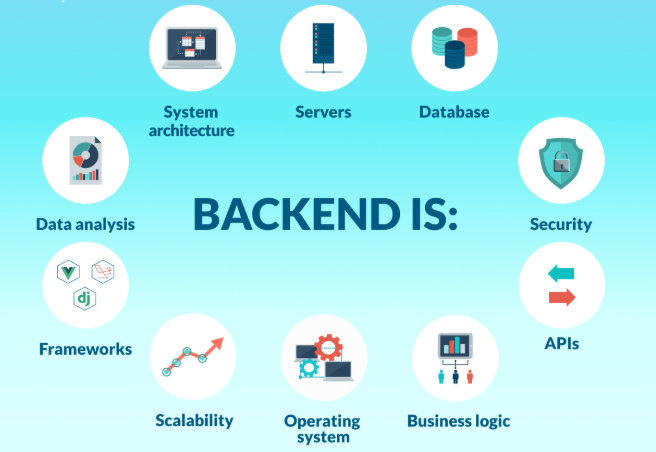

# Introducción al DWES. Arquitecturas y tecnologías de programación web

<i>fuente: https://ddi-dev.com/</i>

## Conceptos teóricos
- [Introducción al desarrollo web](./conceptos/UT01_Introduccion_DWES.pdf)
    - [Arquitecturas](./conceptos/arquitecturas-software.md)
- [Qué sucede cuando escribes una URL en el navegador](./conceptos/url.md)
- [SPA vs MPA](./conceptos/spa-vs-mpa-esquema.md)
    - [Quizziz](https://profemelola.github.io/DWES-01-2026-27/spa-vs-mpa-quiz)
- [JakartaEE](./conceptos/Jakarta.pdf)
    - Ver por encima, con un Servlet y una JSP básicos para entender el flujo básico **request → controlador → modelo → vista → response** (esa culturilla legacy antes de saltar directo a Spring y así entender qué hacen por debajo  sus anotaciones)."
        - Spring Boot no sustituye Jakarta EE, lo construye encima: su Dispatcher­Servlet es, en el fondo, un único Servlet.
    - [Versiones java en entornos empresariales](./conceptos/versiones-java.md)
    - [Servlets](./conceptos/Intro_Servlets.pdf)
    - [JSP](./conceptos/jsp.md)

- Herramientas
    - [Maven](./conceptos/maven.md)
    - [Git/GitHub](./conceptos/git-github-intellij-guia.md)

- Programación declarativa y reactiva con java
    - [Comparativa java 1º curso vs java 2º curso](./conceptos/comparativa_java_moderno.md)
    - [Api Stream](./conceptos/api-stream.md)
    - [Programación funcional](./conceptos/programacion-funcional.md)

## Práctica
- [1. Método init() de un Servlet](./ejercicios/init.md)
- [2. Alta usuario. Métodos GET y POST](./ejercicios/alta-usuario.md)

---
## Página principal del curso
[VOLVER PÁGINA PRINCIPAL](https://github.com/profeMelola/DWES-00-2026-27)

## Licencia

 Este obra está bajo una <a rel="license" href="http://creativecommons.org/licenses/by-nc-sa/4.0/">licencia de Creative Commons Reconocimiento-NoComercial-CompartirIgual 4.0 Internacional</a>.
