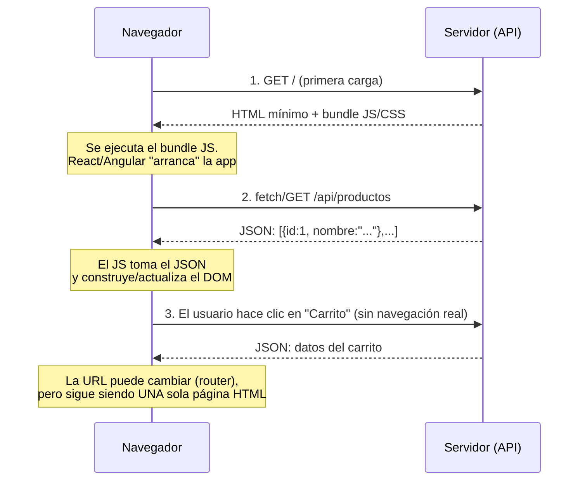
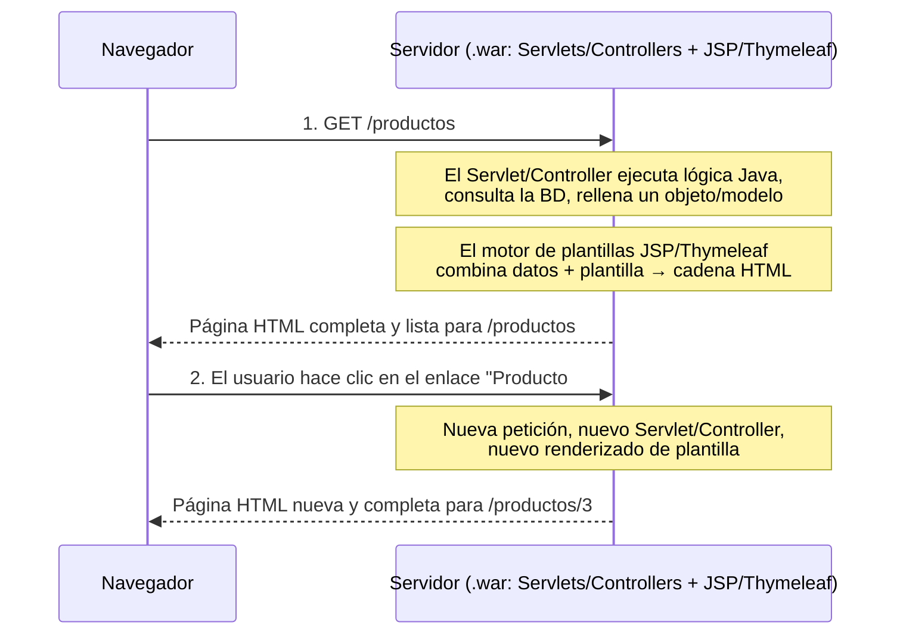

# SPA vs MPA: ¿De dónde sale el HTML?

## 1. ¿Quién construye el HTML final que pinta el navegador: el navegador (JavaScript) o el servidor?"

| | SPA (React / Angular) | MPA (Jakarta EE, o Spring MVC + Thymeleaf) |
|---|---|---|
| ¿Quién construye el HTML? | El **navegador**, en tiempo de ejecución, con JS | El **servidor**, antes de enviar la respuesta |
| ¿Qué envía el servidor en la primera carga? | Un `index.html` casi vacío + un bundle JS | Una **página HTML completa, lista para renderizar** |
| ¿Qué envía el servidor en cada navegación/interacción? | **Datos JSON** (mediante llamadas REST/fetch) | Una **página HTML nueva y completa** |
| ¿Cuántas "páginas" carga realmente el navegador? | **Una sola** (la app "simula" la navegación) | **Muchas** (una por cada acción/enlace) |
| ¿Dónde vive la lógica de la aplicación? | Mayormente en el **navegador** (JS) | Mayormente en el **servidor** (Java) |

---

## 2. SPA: React / Angular

**Idea clave:** después del paso 1, el servidor casi nunca vuelve a enviar HTML. Solo envía **datos (JSON)**. La transformación *datos → HTML visible* ocurre **dentro del navegador**, la hace React/Angular.

Por eso decimos que las apps SPA se **renderizan en el cliente**: el paso de "renderizado" (JSON → DOM) ocurre en el cliente.

---

## 3. MPA: Jakarta EE (Servlet + JSP) y Spring MVC + Thymeleaf

**Idea clave:** el `.war` desplegado en el servidor contiene **tanto** la lógica (Servlets/Controllers) **como** las vistas (JSP/JSF/Thymeleaf). El motor de plantillas se ejecuta **en el servidor**, combina los datos Java con una plantilla HTML, y envía un **documento HTML terminado, estático en ese instante**. El navegador apenas trabaja: solo pinta lo que ha recibido.

Por eso decimos que las apps MPA se **renderizan en el servidor**: el paso de "renderizado" (datos → HTML) ocurre en el servidor, y cada navegación implica un nuevo viaje de ida y vuelta con una página completa.

---

## 4. El recorrido concreto de vuestro curso: 3 backends, misma familia MPA

Las tres tecnologías de servidor que veis construyen el HTML **en el servidor** — solo se diferencian en *cuánto de moderno/cómodo* es el tooling.

| | Jakarta EE (Servlet + JSP) | Spring MVC + Thymeleaf | Spring REST API |
|---|---|---|---|
| Tipo de arquitectura | MPA | MPA | **No es ni MPA ni SPA por sí sola** — es la *mitad servidor* de una SPA (o de una app móvil, o de cualquier cliente) |
| Devuelve | Página HTML completa | Página HTML completa | JSON / XML |
| Patrón | El Servlet hace la lógica, el JSP renderiza | El Controller (MVC) rellena un Modelo, Thymeleaf renderiza la Vista | El Controller (`@RestController`) devuelve datos directamente, sin Vista |
| Quién lo consume | El navegador, directamente, como página | El navegador, directamente, como página | Un **frontend aparte** (app React/Angular, app móvil, otro servicio...) |

Una API REST de Spring **no es** "la versión servidor de una SPA". Es simplemente **el backend con el que habla cualquier SPA (u otro cliente)**. La API REST por sí sola no tiene interfaz de usuario alguna — React/Angular es lo que convierte su JSON en pantallas.

### Ejemplo PokeAPI

API (Python con el framework Django + PostgreSQL): https://pokeapi.co/

Aplicación web que consume el API (arquitectura JS más antigua, típica de Backbone.js + RequireJS + jQuery (muy popular entre 2012-2016), no un framework moderno tipo React/Angular): https://www.pokemon.com/es/pokedex

---

## 5. Tabla comparativa completa

| Criterio | SPA (React/Angular) | MPA – Jakarta EE / Spring MVC+Thymeleaf |
|---|---|---|
| Dónde se renderiza | Cliente (navegador) | Servidor |
| Velocidad de la primera carga | Más lenta (hay que descargar JS y luego renderizar) | Más rápida en el primer pintado (el HTML llega ya listo) |
| Sensación al navegar | Instantánea, tipo app, sin recarga completa | Recarga completa de la página cada vez |
| Payload del servidor | JSON (pequeño, solo datos) | HTML completo (más grande, incluye marcado) |
| Acoplamiento front/back | Desacoplado — proyectos desplegables separados | Acoplado — una sola unidad desplegable (`.war`) |
| SEO de serie | Pobre  | Bueno |
| Gestión de estado | Compleja (necesita Redux/Context/Signals...) | Sencilla — el estado vive en el servidor/sesión |
| Caso de uso típico | Dashboards, paneles de administración, apps tras login | Sitios de contenido público, apps corporativas cargadas de formularios |

---

## 6. Cuándo elegir cada una — Ejemplos concretos

| Escenario | Mejor opción | Por qué |
|---|---|---|
| Catálogo público de un e-commerce (necesita posicionar en Google) | **MPA** (o SPA + SSR) | Los buscadores necesitan ver el contenido de inmediato |
| Dashboard interno de empresa (solo empleados logueados) | **SPA** | No hay necesidad de SEO; importa más la interactividad rica |
| App bancaria, portal de seguros, sistema de gestión logística | **MPA** (Spring MVC o incluso Jakarta EE) o **SPA + API segura aparte** | Estabilidad, control de sesión, auditabilidad, tooling maduro |
| Experiencia tipo app móvil (arrastrar y soltar, filtros en vivo, chat) | **SPA** | Necesita actualizar la interfaz al instante sin recargas completas |
| Blog / sitio de noticias / landing de marketing | **MPA** | El SEO es la prioridad número uno |
| Una misma empresa: sitio público de marketing **y** panel de administración interno | **MPA para el sitio público**, **SPA (consumiendo una API REST) para el panel de admin** | Necesidades distintas → arquitectura distinta para cada parte |
| Un producto necesita web **y** app móvil compartiendo el mismo backend | **API REST de Spring** como backend único, consumida por una **SPA** (web) y una **app nativa/móvil** | Una sola fuente de datos, varios clientes |

---

## 7. El problema del SEO en las SPA (y por qué los sitios "SEO-críticos" tienden a MPA)

**El problema de fondo:**

Los rastreadores de buscadores han funcionado históricamente así: piden una URL → leen el **HTML que reciben** → indexan ese texto. Por defecto, **no ejecutan JavaScript** como lo haría un navegador real (e incluso cuando los rastreadores modernos *pueden* ejecutar JS, es más lento, más costoso para el rastreador y menos fiable).

En una SPA pura:
- El servidor responde a `GET /productos` con algo como: `

` + una etiqueta `<script>`.
- **No hay contenido de productos en ese HTML crudo.** El contenido solo aparece *después* de que el JavaScript se ejecute y pida el JSON.
- Un rastreador que no ejecuta JS por completo (o que se queda sin tiempo antes de que el JS termine) ve una **página vacía**. Nada que indexar. Sin título, sin descripción, sin texto de producto, sin palabras clave relevantes.

**Consecuencia:** una SPA renderizada puramente en el cliente puede posicionar muy mal en contenido público y "descubrible", aunque el contenido sea excelente — porque el rastreador nunca llega a "leerlo".

**Por qué esto importa más en unos sitios que en otros:**
- Un sitio que vive o muere del tráfico orgánico de Google (noticias, blogs, catálogos de e-commerce, páginas de marketing) **no se puede permitir** este riesgo.
- Un sitio tras un muro de login (herramientas internas, dashboards, paneles de administración SaaS) no lo necesita — Google nunca lo va a indexar de todas formas.

**La respuesta de la industria — "quiero la experiencia SPA, pero con el HTML pre-renderizado":**

Por esto exactamente React y Angular **también** ofrecen opciones de renderizado en servidor/estilo MPA:

| Técnica | Qué hace | Frameworks de ejemplo |
|---|---|---|
| **SSR (Server-Side Rendering)** | La app React/Angular se ejecuta *una vez* en el servidor por cada petición, genera HTML completo (como una MPA tradicional), y luego el JS "hidrata" ese HTML en el navegador para volverlo interactivo | Next.js (React), Angular Universal (Angular) |
| **SSG (Static Site Generation)** | El HTML se pre-construye en *tiempo de compilación* (no por cada petición) y se sirve como archivos estáticos — muy bueno para SEO y muy rápido | Next.js, Gatsby, Angular Universal (modo prerender) |
| **Renderizado híbrido** | Algunas rutas son SSR/SSG (páginas públicas, críticas para SEO), otras siguen siendo SPA pura renderizada en cliente (áreas de dashboard tras login) | Next.js App Router, Angular SSR |

> "SPA" y "renderizar HTML en el servidor" no son mutuamente excluyentes. React/Angular, *con SPA*, renderizan en el cliente, pero esos mismos frameworks tienen herramientas oficiales (Next.js, Angular Universal) para renderizar ese primer HTML en el servidor también — precisamente para resolver el problema del SEO — sin renunciar a la interactividad tipo SPA después de esa primera carga.

---

## 8. Por qué las apps críticas / corporativas / logísticas suelen elegir Java (Spring) o C# (.NET) con plantillas MVC

Este es un eje distinto al de SPA-vs-MPA — trata sobre la **elección de lenguaje/plataforma para el backend**.

**Qué significa "stack sólido" en la práctica:**

| Requisito en software empresarial/crítico | Por qué Java (Spring) / C# (.NET) lo cumplen |
|---|---|
| **Tipado estático fuerte** | Los errores se detectan en tiempo de compilación, no en producción — crítico cuando un bug significa una factura incorrecta o un envío perdido |
| **Ecosistema maduro y probado** | Ambas plataformas tienen 20-25+ años, con enormes librerías para seguridad, transacciones, ORM, mensajería, testing |
| **Frameworks de nivel empresarial ya integrados** | Spring: inyección de dependencias, gestión de transacciones, Spring Security, Spring Data. .NET: Entity Framework, Identity, DI integrado — no son añadidos, son de primera clase |
| **Soporte a largo plazo y compatibilidad retroactiva** | Las corporaciones mantienen sistemas 10-15+ años; ambos ecosistemas garantizan versiones LTS y rutas de actualización estables |
| **Tooling robusto para equipos grandes** | Tipado estático + IDEs (IntelliJ, Visual Studio) dan seguridad al refactorizar, navegación de código y contratos en tiempo de compilación en bases de código multi-equipo |
| **Integridad transaccional** | Logística/banca necesitan transacciones ACID garantizadas entre servicios — JTA (Java) y `TransactionScope` de .NET son soluciones maduras y bien entendidas |
| **Disponibilidad de talento y formación** | Gran y estable bolsa de desarrolladores Java/.NET empresariales — menor riesgo de contratación/formación para un sistema de 10 años que un ecosistema JS de rápida evolución |
| **Trayectoria de seguridad y certificaciones** | Ambas plataformas llevan décadas endureciendo la seguridad empresarial, con tooling de cumplimiento (auditorías, integraciones con certificaciones como ISO, SOC2) |

**Por qué específicamente MVC + plantillas renderizadas en servidor (Spring MVC+Thymeleaf, ASP.NET MVC/Razor) en vez de "ir siempre a SPA":**

- **El control de sesión/estado se queda en el servidor** — más fácil de auditar, más fácil de asegurar, más fácil de garantizar consistencia (importante en logística: "¿realmente se actualizó el estado de este envío?").
- **Menos piezas móviles** — una sola app desplegable, un solo stack tecnológico, un solo equipo, en vez de coordinar un equipo/repositorio/ciclo de release de frontend separado.
- **Predictibilidad por encima de la moda** — el software corporativo/logístico está optimizado para **décadas de mantenibilidad**, no para la experiencia de interfaz más moderna. Una app basada en formularios y MVC "menos vistosa", que un desarrollador Java/.NET pueda mantener en 2035, gana a un stack SPA de última generación que quizá quede obsoleto o difícil de contratar para entonces.
- **No son mutuamente excluyentes** — muchas grandes empresas **sí** combinan un backend Spring Boot o .NET (expuesto como API REST) con un frontend SPA en React/Angular para las partes del sistema que necesitan interactividad rica (p. ej., un dashboard logístico), mientras mantienen MVC/Thymeleaf/Razor para pantallas internas más simples, de back-office, cargadas de formularios. La elección se hace **por pantalla/módulo**, no como una regla única para toda la empresa.

> La solidez en el software empresarial crítico no depende de qué framework parezca más moderno, sino de la seguridad del tipado, la madurez, el soporte a largo plazo y la mantenibilidad predecible durante más de 10 años. Por eso Java/Spring y C#/.NET dominan los backends de banca, seguros y logística, tenga o no la interfaz encima forma de SPA.

---

## 9. Frameworks con motores de plantillas (MPA)

| Framework | Lenguaje | Motor de plantillas | Patrón principal |
|---|---|---|---|
| **Jakarta EE** (Servlet + JSP) | Java | **JSP** (JavaServer Pages) | Servlet-based, más "bajo nivel" |
| **Spring MVC** | Java | **Thymeleaf** (el estándar actual) — también soporta JSP, FreeMarker o Mustache | MVC |
| **ASP.NET (.NET)** | C# | **Razor** (`.cshtml`) | MVC (Razor Pages o MVC clásico) |
| **Django** | Python | **DTL** (Django Template Language) — motor propio | MVC (ellos lo llaman MTV: Model-Template-View) |
| **Flask** | Python | **Jinja2** | Microframework, sin MVC forzado |
| **Laravel** | PHP | **Blade** | MVC |
| **Symfony** | PHP | **Twig** | MVC |
| **Ruby on Rails** | Ruby | **ERB** (Embedded Ruby) | MVC |
| **Express.js** | JavaScript (Node.js) | Sin motor por defecto — se elige: **EJS**, **Pug**, **Handlebars**... | Microframework, sin MVC forzado |

---

## 10. Chuleta

- **SPA** = una sola "carcasa" HTML para siempre. El JS pide JSON, el JS construye el DOM. El servidor = solo proveedor de datos.
- **MPA (Jakarta EE / Spring MVC+Thymeleaf)** = cada clic puede ser una página HTML nueva y completa, construida por el servidor antes de enviarla.
- **API REST** ≠ MPA y ≠ SPA. Es solo un **backend que solo habla JSON** — necesita *algún* cliente (SPA, app móvil...) para convertirse en interfaz.
- **Problema del SEO** = los rastreadores pueden no ver el contenido de una SPA porque no hay HTML hasta que se ejecuta el JS → se soluciona con SSR/SSG (Next.js, Angular Universal), no abandonando la arquitectura SPA.
- **Stacks empresariales/críticos** (Java/Spring, C#/.NET) se eligen por **tipado, madurez y mantenibilidad a 10+ años** — con independencia de que la interfaz acabe siendo SPA o MPA.

---

## 11. Vídeo. Aplicaciones SPA vs MPA

Os recomiendo ver este vídeo aunque es de 2020 y no habla de Spring  ni ASP.NET...

  

---

## 12. Otros recursos

Más de lo mismo... echadle un ojo

https://github.com/joseluisgs/DesarrolloWebEntornosServidor-01-2026-2027/blob/main/06-web-dinamica.md
