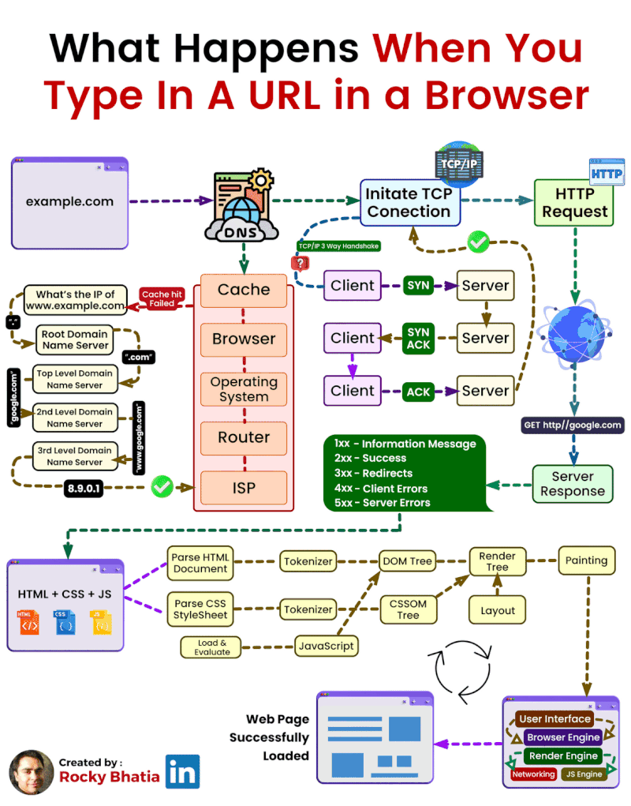

# ¿Qué sucede cuando escribes una URL en el navegador?

1. **DNS** – El navegador busca la IP del dominio: primero mira su caché, y si no la tiene, pregunta en cascada al servidor raíz → al de ".com" → al del dominio específico, hasta obtener la IP.

2. **Conexión TCP** – Se establece la conexión con el servidor mediante el "triple apretón de manos": SYN (cliente) "¿Hola, me oyes?" → SYN-ACK (servidor)"Sí te oigo, ¿y tú a mí?"   → ACK "Sí, te oigo"(cliente).
 
3. **Petición HTTP** – El navegador envía la solicitud (GET) y el servidor responde con un código de estado: 1xx (info), 2xx (éxito), 3xx (redirección), 4xx (error del cliente) o 5xx (error del servidor).

4. **Renderizado** – Con el HTML, CSS y JS recibidos, el navegador construye la página en paralelo: el HTML se convierte en el árbol DOM, el CSS en el CSSOM, y ambos se combinan en el "render tree", que luego se distribuye en pantalla (layout) y se pinta (painting).

5. **Página cargada** – El motor de renderizado y el de JavaScript trabajan juntos para mostrar la interfaz final al usuario.
