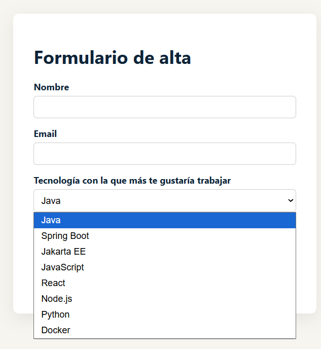
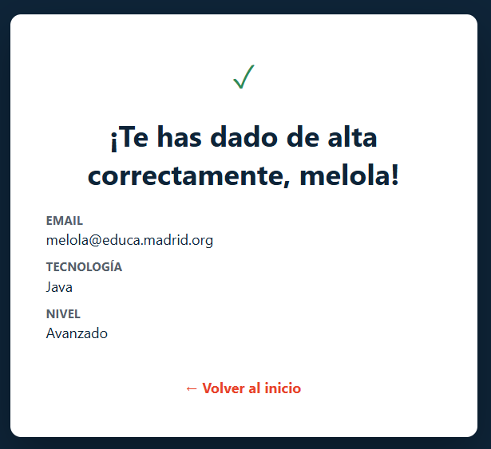

# Alta de usuario con Servlet + JSP

## Objetivo

Trabajar con  Servlets/JSP: una página de inicio, un Servlet que reparte entre `GET` y `POST`, un formulario cuyo `<select>` se carga dinámicamente **desde un fichero del servidor** (persistencia simple, sin base de datos) y una confirmación que refleja los datos leídos como parámetros.

## Lo que se pone en juego

| Conceptos | Dónde aparece aquí |
|---|---|
| `doGet` vs `doPost` | Un mismo Servlet reparte según el método HTTP |
| Lectura de parámetros (`request.getParameter`) | Al procesar el formulario |
| `RequestDispatcher.forward()` | Servlet → JSP, en los dos sentidos |
| `WEB-INF` protegido | Ahí vive el fichero de datos — nadie puede pedirlo por URL |
| MVC | Servlet = Controlador · JSP = Vista · lista de tecnologías + datos del formulario = Modelo |
| EL (`${...}`) | Para pintar la confirmación, sin scriptlets |

## Flujo de la práctica






```
index.html                AltaServlet                      JSP
    |                          |                             |
    |--- GET /alta ----------->|                             |
    |                          |-- lee tecnologias.txt ------>|
    |                          |-- forward ------------------>| formulario.jsp
    |<---------------------------------------- HTML del formulario
    |
    | (el usuario rellena y envía)
    |
    |--- POST /alta (datos) -->|
    |                          |-- request.getParameter(...) |
    |                          |-- forward ------------------>| confirmacion.jsp
    |<---------------------------------------- "Alta correcta"
```

---

## Enunciado (para el alumnado)

Crea un proyecto Jakarta EE (`alta-usuario`, Maven, packaging `war`) con lo siguiente:

1. **`index.html`** — página de bienvenida con un mensaje del tipo *"¿Quieres darte de alta en la aplicación?"* y un botón que lleve, con una petición `GET`, a la ruta `/alta`.

2. **Un fichero de datos** dentro de `WEB-INF/datos/tecnologias.txt`, con una tecnología por línea (mínimo 5-6 líneas). Debe estar en `WEB-INF` y no directamente en `webapp/` — pensad por qué, ya lo vimos en la guía de Servlets.

3. **`AltaServlet`**, mapeado a `/alta`:
   - En `doGet`: lee el fichero de tecnologías línea a línea, lo guarda como atributo del `request` y reenvía (`forward`) a `formulario.jsp`.
   - En `doPost`: lee los parámetros que envía el formulario (nombre, email, tecnología elegida, nivel), los guarda como atributos del `request` y reenvía a `confirmacion.jsp`.

4. **`formulario.jsp`** — un formulario (`method="post"`, `action="alta"`) con al menos:
   - Un campo de texto (`nombre`).
   - Un campo de email (`email`).
   - Un `<select>` (`tecnologia`) cuyas `<option>` se generan a partir de la lista que llega desde el Servlet — **no las escribáis a mano**, tienen que salir del fichero.
   - Un segundo `<select>` o radio buttons con un dato fijo (`nivel`: Principiante / Intermedio / Avanzado).

5. **`confirmacion.jsp`** — un mensaje de éxito ("Te has dado de alta correctamente") que muestre, con EL, los datos que se acaban de enviar.

**Restricción:** solo Servlet + JSP, sin JSTL. Para generar las `<option>` del `<select>` dinámico vais a necesitar un scriptlet (`<% %>`) — es una de las pocas veces que se justifica usarlo; en cuanto veáis JSTL, ese bucle se sustituye por un `<c:forEach>`.

---

## Estructura del proyecto

```
alta-usuario/
├── pom.xml
└── src/main/
    ├── java/com/instituto/controller/
    │   └── AltaServlet.java
    └── webapp/
        ├── index.html
        ├── formulario.jsp
        ├── confirmacion.jsp
        └── WEB-INF/
            └── datos/
                └── tecnologias.txt
```

---

## Solución guiada

### 1. El fichero de datos

`src/main/webapp/WEB-INF/datos/tecnologias.txt`:
```
Java
Spring Boot
Jakarta EE
JavaScript
React
Node.js
Python
Docker
```

Va dentro de `WEB-INF` a propósito: es el mismo motivo que visteis en la página 3 de la guía de Servlets — todo lo que hay ahí dentro está protegido, nadie puede pedirlo directamente por URL, solo lo lee el propio servidor. Si lo hubiéramos puesto suelto en `webapp/`, cualquiera podría descargarse el fichero escribiendo su ruta en el navegador.

### 2. `index.html`

```html
<!DOCTYPE html>
<html lang="es">
<head>
<meta charset="UTF-8">
<title>Bienvenido</title>
<style>
  body {
    font-family: 'Segoe UI', Arial, sans-serif;
    background: #0E2438;
    color: #fff;
    display: flex;
    align-items: center;
    justify-content: center;
    height: 100vh;
    margin: 0;
  }
  .card {
    background: #fff;
    color: #0E2438;
    padding: 48px 40px;
    border-radius: 12px;
    text-align: center;
    max-width: 420px;
    box-shadow: 0 20px 50px rgba(0,0,0,.3);
  }
  h1 { margin-top: 0; font-size: 1.5rem; }
  p { color: #55606B; }
  a.boton {
    display: inline-block;
    margin-top: 24px;
    background: #E8432A;
    color: #fff;
    padding: 14px 32px;
    border-radius: 8px;
    text-decoration: none;
    font-weight: bold;
  }
  a.boton:hover { background: #c93a22; }
</style>
</head>
<body>
  <div class="card">
    <h1>¿Quieres darte de alta en la aplicación?</h1>
    <p>Regístrate en unos segundos y cuéntanos qué tecnología te interesa más.</p>
    <a class="boton" href="alta">Darme de alta</a>
  </div>
</body>
</html>
```

El botón es un enlace normal (`<a href="alta">`) — un enlace siempre genera una petición `GET`, por eso cae en `doGet`.

### 3. Controlador a completar: `AltaServlet.java`

```java

@WebServlet("/alta")
public class AltaServlet extends HttpServlet {

    private static final Logger logger = Logger.getLogger(AltaServlet.class.getName());

    @Override
    protected void doGet(HttpServletRequest request, HttpServletResponse response)
            throws ServletException, IOException {


    }

    @Override
    protected void doPost(HttpServletRequest request, HttpServletResponse response)
            throws ServletException, IOException {


    }

}
```

### 4. Plantilla a completar: `formulario.jsp`

```jsp
<%@ page contentType="text/html; charset=UTF-8" language="java" %>
<%@ page import="java.util.List" %>
<!DOCTYPE html>
<html lang="es">
<head>
<meta charset="UTF-8">
<title>Formulario de alta</title>
<style>
  body { font-family: 'Segoe UI', Arial, sans-serif; background: #F7F5F0; color: #0E2438; }
  .form-card { max-width: 460px; margin: 60px auto; background: #fff; padding: 32px 36px;
               border-radius: 10px; box-shadow: 0 8px 30px rgba(0,0,0,.08); }
  label { display: block; font-weight: bold; margin: 16px 0 6px; }
  input, select { width: 100%; padding: 9px; border: 1px solid #ccc; border-radius: 6px;
                  box-sizing: border-box; font-size: 1rem; }
  button { margin-top: 24px; background: #E8432A; color: #fff; border: none; padding: 12px 28px;
           border-radius: 8px; font-weight: bold; cursor: pointer; }
  button:hover { background: #c93a22; }
</style>
</head>
<body>
  <div class="form-card">
    <h1>Formulario de alta</h1>
    <form action="alta" method="post">

      <label for="nombre">Nombre</label>
      <input type="text" id="nombre" name="nombre" required>

      <label for="email">Email</label>
      <input type="email" id="email" name="email" required>

      <label for="tecnologia">Tecnología con la que más te gustaría trabajar</label>
      <select id="tecnologia" name="tecnologia">
 
            <option value=" "> </option>
      </select>

      <label for="nivel">Tu nivel actual</label>
      <select id="nivel" name="nivel">
        <option value="Principiante">Principiante</option>
        <option value="Intermedio">Intermedio</option>
        <option value="Avanzado">Avanzado</option>
      </select>

      <button type="submit">Enviar</button>
    </form>
  </div>
</body>
</html>
```

El `<select>` de tecnologías se genera con un `for` dentro de un scriptlet, recorriendo la lista que llegó del Servlet — ninguna opción está escrita a mano, si cambias el `.txt` cambia el formulario sin tocar el JSP.

### 5. Plantilla a completar:  `confirmacion.jsp`

```jsp
<%@ page contentType="text/html; charset=UTF-8" language="java" %>
<!DOCTYPE html>
<html lang="es">
<head>
<meta charset="UTF-8">
<title>Alta correcta</title>
<style>
  body { font-family: 'Segoe UI', Arial, sans-serif; background: #0E2438; color: #fff;
         display: flex; align-items: center; justify-content: center; height: 100vh; margin: 0; }
  .card { background: #fff; color: #0E2438; padding: 44px 40px; border-radius: 12px;
          text-align: center; max-width: 440px; box-shadow: 0 20px 50px rgba(0,0,0,.3); }
  .ok { color: #2E8B57; font-size: 2.2rem; }
  dl { text-align: left; margin-top: 20px; }
  dt { font-weight: bold; color: #55606B; font-size: .85rem; text-transform: uppercase; margin-top: 10px; }
  dd { margin: 2px 0 0; }
  a { display: inline-block; margin-top: 24px; color: #E8432A; font-weight: bold; text-decoration: none; }
</style>
</head>
<body>
  <div class="card">
    <div class="ok">&#10003;</div>
    <h1>¡Te has dado de alta correctamente, ${nombre}!</h1>

    <dl>
      <dt>Email</dt><dd></dd>
      <dt>Tecnología</dt><dd></dd>
      <dt>Nivel</dt><dd></dd>
    </dl>

    <a href="index.html">&larr; Volver al inicio</a>
  </div>
</body>
</html>
```

Aquí ya no hace falta scriptlet: son solo expresiones EL leyendo los atributos que `doPost` dejó en el `request`.

---

## Cómo probarlo

1. Desplegar y abrir `index.html`.
2. Pulsar el botón → debe llegar a `/alta` por `GET` y ver el formulario con el `<select>` ya relleno desde el fichero.
3. Rellenar y enviar → debe llegar a `/alta` por `POST` (mismo Servlet, otro método) y mostrar la confirmación con los datos correctos.
4. Cambiar una línea de `tecnologias.txt`, redesplegar y comprobar que el `<select>` cambia sin tocar ni una línea de JSP ni de Java.


## Ampliación: validaciones

Validad en `doPost` que `nombre` y `email` no lleguen vacíos (`request.getParameter("nombre") == null || ....isBlank()`), y si falla, reenviad otra vez a `formulario.jsp` con un mensaje de error como atributo, en lugar de ir a `confirmacion.jsp`.


### Ejemplo de error.jsp:

```html
<%--
  Created by IntelliJ IDEA.
  User: melol
  Date: 16/09/2026
  Time: 18:55
  To change this template use File | Settings | File Templates.
--%>
<%@ page contentType="text/html; charset=UTF-8" language="java" %>
<!DOCTYPE html>
<html lang="es">
<head>
    <meta charset="UTF-8">
    <title>Ha ocurrido un error</title>
    <style>
        body { font-family: 'Segoe UI', Arial, sans-serif; background: #0E2438; color: #fff;
            display: flex; align-items: center; justify-content: center; height: 100vh; margin: 0; }
        .card { background: #fff; color: #0E2438; padding: 44px 40px; border-radius: 12px;
            text-align: center; max-width: 440px; box-shadow: 0 20px 50px rgba(0,0,0,.3); }
        .error-icon { color: #E8432A; font-size: 2.2rem; }
        p.msg { color: #55606B; margin-top: 16px; }
        a { display: inline-block; margin-top: 24px; color: #E8432A; font-weight: bold; text-decoration: none; }
    </style>
</head>
<body>
<div class="card">
    <div class="error-icon">&#9888;</div>
    <h1>Vaya, algo ha fallado</h1>
    <p class="msg">${mensajeError}</p>
    <a href="index.html">&larr; Volver al inicio</a>
</div>
</body>
</html>
```

---

## Ampliación: scriptlet vs JSTL

 `<select>` en vez de con scriptlet con JSTL.

### Comparativa

| | Scriptlet (lo que han hecho) | JSTL (lo "correcto" en un proyecto real) |
|---|---|---|
| Código en el `<select>` | `<% for (...) { %> ... <% } %>` | `<c:forEach var="t" items="${tecnologias}">` |
| Java visible en el JSP | Sí — import, cast, bucle | No — cero Java |
| Requiere configuración extra | No | Sí — dependencia en `pom.xml` + `taglib` |
| Qué van a encontrar en el mundo real | Poco (versión "cruda" educativa) | Bastante, en apps Jakarta EE heredadas |

### 1. Añadir la dependencia en `pom.xml`

```xml
<dependency>
    <groupId>jakarta.servlet.jsp.jstl</groupId>
    <artifactId>jakarta.servlet.jsp.jstl-api</artifactId>
    <version>3.0.0</version>
</dependency>
<dependency>
    <groupId>org.glassfish.web</groupId>
    <artifactId>jakarta.servlet.jsp.jstl</artifactId>
    <version>3.0.1</version>
</dependency>
```

Sin `<scope>provided</scope>`: a diferencia de `jakarta.servlet-api` (que ya pone Tomcat), las clases de JSTL no las trae el servidor — tienen que ir empaquetadas dentro del `.war`, en `WEB-INF/lib`.

### 2. Declarar el taglib en el JSP

```jsp
<%@ taglib uri="jakarta.tags.core" prefix="c" %>
```

(Ojo: en Jakarta EE 9+ la URI cambió de `http://java.sun.com/jsp/jstl/core` — la versión "clásica" que se ve en tutoriales antiguos con `javax.*` — a `jakarta.tags.core`. Es el mismo cambio de espacio de nombres que ya visteis con `javax.servlet` → `jakarta.servlet`.)

### 3. `formulario.jsp` con JSTL

```jsp
<%@ page contentType="text/html; charset=UTF-8" language="java" %>
<%@ taglib uri="jakarta.tags.core" prefix="c" %>
<!DOCTYPE html>
<html lang="es">
<head>
<meta charset="UTF-8">
<title>Formulario de alta</title>
<style>
  body { font-family: 'Segoe UI', Arial, sans-serif; background: #F7F5F0; color: #0E2438; }
  .form-card { max-width: 460px; margin: 60px auto; background: #fff; padding: 32px 36px;
               border-radius: 10px; box-shadow: 0 8px 30px rgba(0,0,0,.08); }
  label { display: block; font-weight: bold; margin: 16px 0 6px; }
  input, select { width: 100%; padding: 9px; border: 1px solid #ccc; border-radius: 6px;
                  box-sizing: border-box; font-size: 1rem; }
  button { margin-top: 24px; background: #E8432A; color: #fff; border: none; padding: 12px 28px;
           border-radius: 8px; font-weight: bold; cursor: pointer; }
  button:hover { background: #c93a22; }
</style>
</head>
<body>
  <div class="form-card">
    <h1>Formulario de alta</h1>
    <form action="alta" method="post">

      <label for="nombre">Nombre</label>
      <input type="text" id="nombre" name="nombre" required>

      <label for="email">Email</label>
      <input type="email" id="email" name="email" required>

      <label for="tecnologia">Tecnología con la que más te gustaría trabajar</label>
      <select id="tecnologia" name="tecnologia">
        <c:forEach var="t" items="${tecnologias}">
          <option value="${t}">${t}</option>
        </c:forEach>
      </select>

      <label for="nivel">Tu nivel actual</label>
      <select id="nivel" name="nivel">
        <option value="Principiante">Principiante</option>
        <option value="Intermedio">Intermedio</option>
        <option value="Avanzado">Avanzado</option>
      </select>

      <button type="submit">Enviar</button>
    </form>
  </div>
</body>
</html>
```

Nada más cambia: `AltaServlet.java` y `confirmacion.jsp` quedan exactamente igual — la única diferencia está en cómo se pinta la lista, no en cómo llega el dato. 

JSTL no cambia la arquitectura ni el flujo, solo limpia la vista.

---

## Ampliación: java.nio


