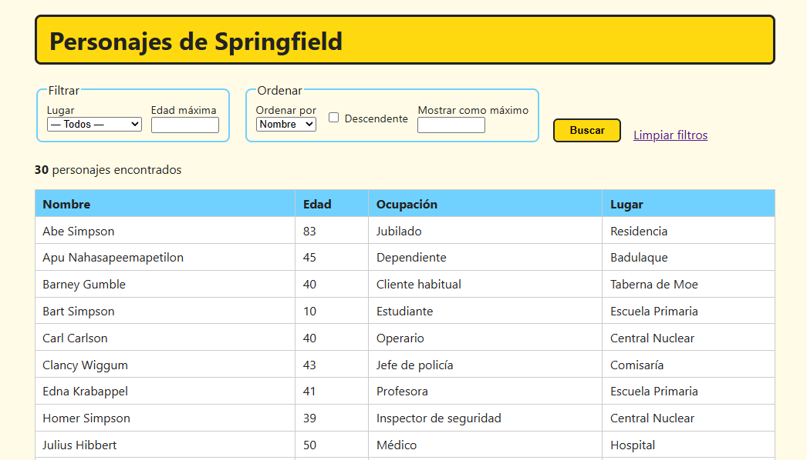

# Personajes de Springfield: primer contacto con el API Stream


Aplicación Jakarta EE mínima (Servlet + JSP + JSTL) que filtra y ordena personajes de Los Simpson usando **streams**.



## Estructura

```
modelo/Personaje.java               ← record con los datos de un personaje
repositorio/PersonajeRepositorio    ← los datos (simulan un JSON o una BD)
servicio/PersonajeServicio          ← AQUÍ están los streams
controlador/PersonajesServlet       ← GET /personajes: parámetros → servicio → JSP
clasico/ComparadorPorEdad           ← recordatorio de 1º (no lo usa la aplicación)
WEB-INF/vistas/personajes.jsp       ← formulario + tabla
```

## Recursos

[Recursos iniciales del proyecto](./ejercicio-03-simpson/recursos)

## Qué operación activa cada campo del formulario

| Campo | Operación del stream |
|---|---|
| Lugar, Edad máxima | `filter(p -> ...)` |
| Ordenar por, Descendente | `sorted(Comparator...)`, `reversed()` |
| Mostrar como máximo | `limit(n)` |
| (el resultado) | `toList()` (operación terminal) |

## Comparator: de 1º a 2º

**En 1º:** una clase aparte que implementa `Comparator` y define `compare()`.

```java
public class ComparadorPorEdad implements Comparator<Personaje> {
    @Override
    public int compare(Personaje p1, Personaje p2) {
        int resultado = Integer.compare(p1.edad(), p2.edad());
        if (resultado == 0) {
            resultado = p1.nombre().compareTo(p2.nombre());
        }
        return resultado;
    }
}
```

**En 2º:** el mismo Comparator, en una línea.

```java
Comparator.comparingInt(Personaje::edad).thenComparing(Personaje::nombre)
```

## Filtrar sin streams y con streams

```java
// 1º: bucle clásico
List<Personaje> resultado = new ArrayList<>();
for (Personaje p : personajes) {
    if (p.lugar().equals("Escuela Primaria") && p.edad() <= 12) {
        resultado.add(p);
    }
}
Collections.sort(resultado, new ComparadorPorEdad());
// ...y el límite aún habría que hacerlo a mano

// 2º: stream
personajes.stream()
        .filter(p -> p.lugar().equals("Escuela Primaria"))
        .filter(p -> p.edad() <= 12)
        .sorted(Comparator.comparingInt(Personaje::edad))
        .limit(5)
        .toList();
```

## Ejercicios propuestos

1. Añadir un filtro por **ocupación**, que funcione igual que el de lugar.
2. Añadir **"Ordenar por lugar"** (y, si empatan, por nombre).
3. Añadir una casilla **"Solo familia Simpson"** que filtre por el atributo `principal`.
